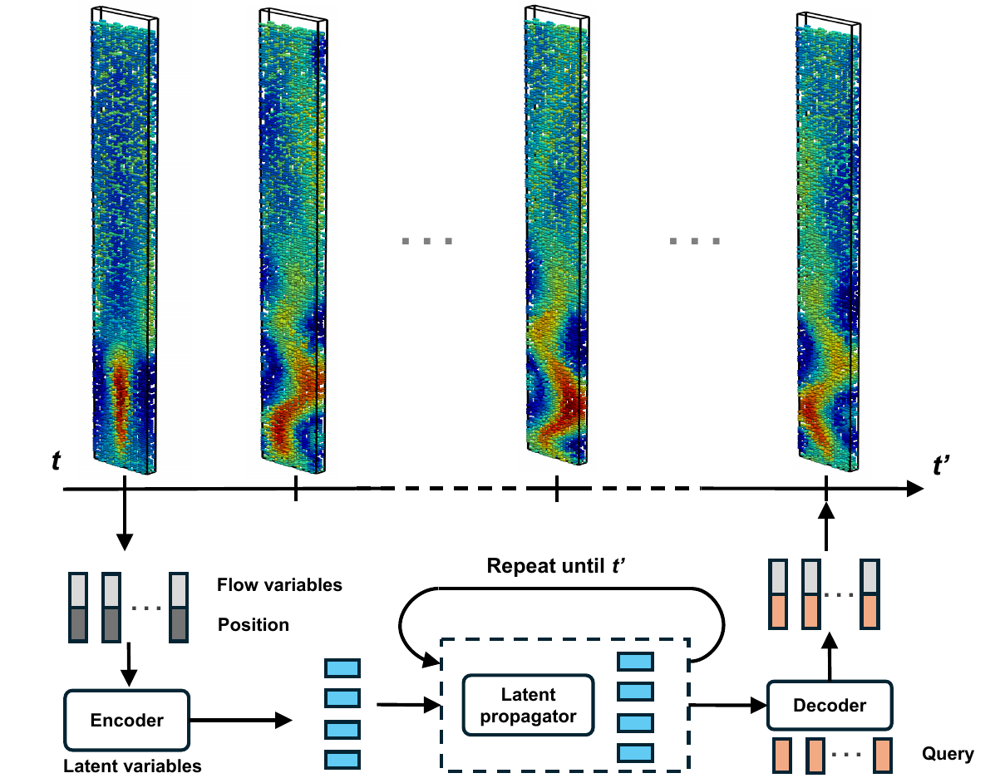

# TENO-for-Multiphase-Flow-Reconstruction Readme

This folder is the GitHub-facing demo bundle for the Time-Evolving Neural
Operator (TENO) study on multiphase-flow reconstruction. It contains an
executed notebook, ready-to-browse rollout GIFs, and CFD reference data for
representative conditioned-preview examples.

The demo notebook presents conditioned-preview examples and visualizes each case
with a corrected-train / free-test rollout:

- Case 1: lid-driven cavity at `Re = 1000`
- Case 2: cylinder wake at `Re = 100`
- Case 3: bubble column at `J_G = 6 mm/s`

In each GIF and notebook preview, the test segment is compared using a
`ground truth / prediction / absolute error` layout, with the time axis shown in
physical CFD time.

This demo builds on the Universal Physics Transformer (UPT) framework and
related public resources:

- UPT project page: <https://ml-jku.github.io/UPT>
- UPT tutorial repository: <https://github.com/BenediktAlkin/upt-tutorial>
- Emmi AI Noether framework: <https://github.com/Emmi-AI/noether>

3D Bubble column simulation modification based on: <https://github.com/GiordiR/BubbleColumn_OpenFOAM>
## Quick links

- Executed notebook: [Case 1-3 demo notebook](./notebooks/case123_demo.ipynb)
- Notebook source: [Case 1-3 demo notebook source](./notebooks/case123_demo.py)
- Highlight slide deck page: [Highlight image.pdf](./Highlight%20image.pdf)

## Directory layout

- `notebooks/`
  - Executed notebook and its Python source used to generate the demo figures.
- `gifs/`
  - Pre-rendered rollout GIFs for Cases 1-3:
    - [`case1_re1000.gif`](./gifs/case1_re1000.gif)
    - [`case2_re100.gif`](./gifs/case2_re100.gif)
    - [`case3_jg6_umag.gif`](./gifs/case3_jg6_umag.gif)
- `cfd_data/case1_re1000/`
  - CFD reference VTK snapshots used by the Case 1 preview.
- `cfd_data/case2_re100/`
  - CFD reference VTK snapshots used by the Case 2 preview.
- `cfd_data/regularized/case1/`
  - Merged regularized Case 1 NPZ datasets for Reynolds-number studies:
    `Re = 500, 1000, 2000`, plus `re_generalization_splits/`.
- `cfd_data/regularized/case2/`
  - Merged regularized Case 2 NPZ datasets for Reynolds-number studies:
    `Re = 50, 100, 200`, plus `re_generalization_splits/`.
- `highlight_image.png`
  - PNG preview extracted from the uploaded highlight PDF for GitHub rendering.
- `Highlight image.pdf`
  - Original uploaded highlight figure.

## Citation

If this repository is useful for your work, please consider citing our pub:

**Ziyun Zhang and Eldin Wee Chuan Lim**  
*Time-Evolving Neural Operator Reconstruction and Prediction of Complex Flows from Sparse Measurements*  
Physics of Fluids 2026 38 (6)  
https://doi.org/10.1063/5.0328615

## Contact

Questions, feedback, or collaboration ideas are welcome. Feel free to contact me: "Ziyoon_Zhang@outlook.com"
